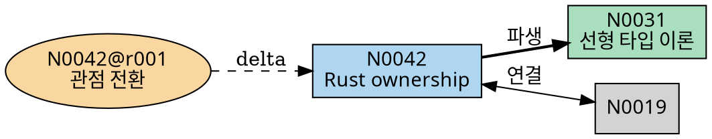
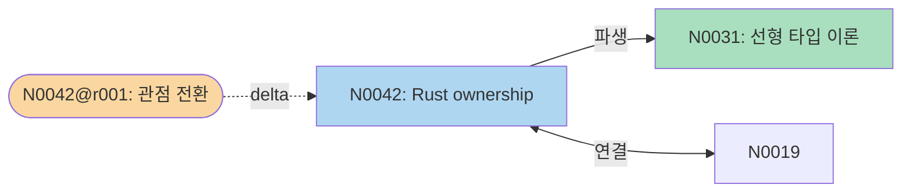

# `elf graph` 설계 문서

## 목적

vault 내 entry·revision 간의 **아이디어 계보(lineage)**를 그래프로 export한다. 어떤 entry가 어떤 baseline에서 파생됐는지, 어떤 entry들이 서로 연결돼 있는지, 어떤 revision 체인을 거쳐 지금의 생각에 도달했는지를 한눈에 파악할 수 있게 한다.

> **v0.2 예정.** v0.1 MVP에는 포함되지 않는다. 이 문서는 설계 예약 문서다.

---

## CLI 인터페이스

```
elf graph [--format <fmt>] [--output <path>] [--entry <id>]
```

| 플래그 | 타입 | 필수 | 기본값 | 설명 |
|--------|------|------|--------|------|
| `--format <fmt>` | string | ❌ | `dot` | 출력 형식: `dot`, `json`, `mermaid` |
| `--output <path>` | string | ❌ | stdout | 결과 파일 저장 경로 |
| `--entry <id>` | EntryID | ❌ | 전체 | 특정 entry와 그 연결망만 출력 |

### 예시

```sh
# 전체 vault 그래프 (Graphviz DOT)
elf graph

# 특정 entry 중심의 로컬 그래프
elf graph --entry N0042 --format mermaid --output graph.md

# CI/외부 도구 연동용 JSON
elf graph --format json --output graph.json
```

---

## 동작 흐름

1. vault 루트 탐지.
2. 노드 수집:
   - `entries/*/manifest.toml` → Entry 노드 (id, title, tags, status)
   - `revisions/*/*` → Revision 노드 (id, baseline)
3. 엣지 수집:
   - `manifest.toml`의 `baseline` → Entry → Entry 수직 계보 엣지
   - `manifest.toml`의 `links` → Entry ↔ Entry 수평 관계 엣지
   - `revisions/N####/r###.md`의 `baseline` frontmatter → Revision → Entry/Revision 엣지
   - `→ see N####` 인라인 참조 → 보조 엣지 (점선)
4. `--entry` 지정 시: BFS로 N홉 이내 연결 노드만 필터링.
5. 선택한 형식으로 직렬화 후 출력.

---

## 그래프 구조

### 노드 타입

| 타입 | ID 예시 | 색상 (DOT) | 도형 |
|------|---------|------------|------|
| Entry (draft) | `N0042` | `#AED6F1` (파랑) | box |
| Entry (stable) | `N0042` | `#A9DFBF` (초록) | box |
| Entry (archived) | `N0042` | `#D5D8DC` (회색) | box |
| Revision | `N0042@r001` | `#FAD7A0` (주황) | ellipse |

### 엣지 타입

| 엣지 | 스타일 | 레이블 |
|------|--------|--------|
| Entry `baseline` → 부모 Entry | 실선, 굵음 | `"파생"` |
| Entry ↔ Entry (`links`) | 실선, 양방향 | `"연결"` |
| Revision `baseline` → Entry/Revision | 점선 | `"delta"` |
| `→ see` 인라인 참조 | 점선, 얇음 | `"참조"` |

---

## 출력 형식 예시

### DOT (Graphviz)



### Mermaid



### JSON

```json
{
  "nodes": [
    { "id": "N0042", "type": "entry", "title": "Rust ownership", "status": "draft", "tags": ["rust"] },
    { "id": "N0042@r001", "type": "revision", "entry": "N0042", "baseline": "N0042@r000" }
  ],
  "edges": [
    { "from": "N0042", "to": "N0031", "kind": "baseline" },
    { "from": "N0042", "to": "N0019", "kind": "link" },
    { "from": "N0042@r001", "to": "N0042", "kind": "revision" }
  ]
}
```

---

## 에러 처리

| 상황 | 종료 코드 | 메시지 |
|------|-----------|--------|
| vault 루트 아님 | 1 | `not inside an elf vault` |
| 알 수 없는 `--format` | 1 | `unknown format "xxx" (supported: dot, json, mermaid)` |
| `--entry` entry 없음 | 1 | `entry "N0099" not found` |
| 노드 없음 | 0 (경고) | `warn: vault is empty — graph has no nodes` |

---

## 구현 노트

- 그래프 데이터 구조: `HashMap<NodeId, Vec<Edge>>` 인접 리스트.
- v0.2에서 `index.sqlite` 도입 시 그래프 쿼리는 sqlite로 이전.
- v0.1에서는 `elf graph` 커맨드 없음. 대신 `elf entry show <id>`의 `links`/`baseline` 필드로 수동 탐색 가능.
- Mermaid ID에서 `@` 문자는 `_at_`으로, `-` 는 `_`로 치환 (파서 제한).
- 향후 `--depth N` 플래그로 `--entry` 기준 탐색 깊이 제한 지원.
